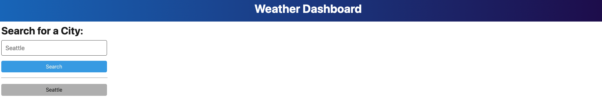
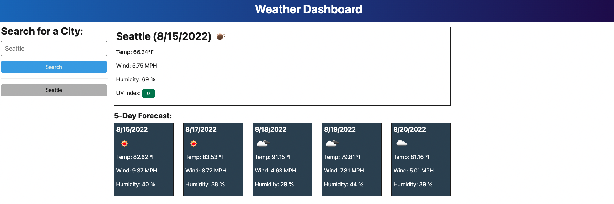
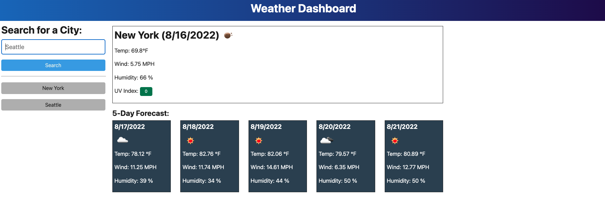

README.md
For this week's assignment we were tasked to created a Weather Dashboard using a third-party API. The specific third-party API we used was from OpenWeather One Call. By the end of this assignment we should have a dashboard that shows a forecast of 5 days for the city that the user inputs.
Link to website: https://hghe95.github.io/HW-6/
Screenshots:

